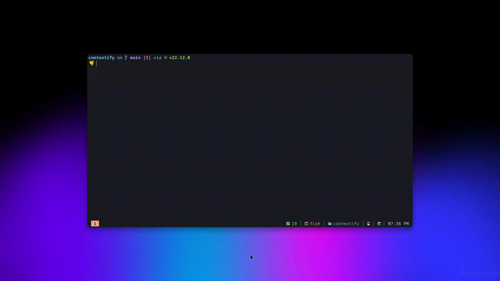

# nr-fish-completion

- Fish completion for [@antfu/ni](https://github.com/antfu-collective/ni) `nr` command

> `jq` should be installed on your system for this to work. You can install it with your system's package manager

## Installation

1. Install [@antfu/ni](https://github.com/antfu-collective/ni) 
2. Install `jq` if it's not installed already.
3. Clone the repo and copy `nr.fish` to `.config/fish/completions`
 
## Usage

